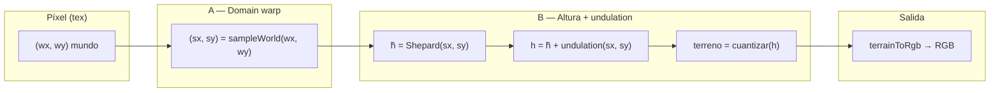

# Cómo se pinta el mapa en píxeles (`MapPixelTexture`)

El mapa lógico sigue siendo una **rejilla hexagonal** con un terreno discreto por celda. La textura que ves es solo **visual**: cada píxel obtiene **un** terreno y **un** color sólido (sin mezcla RGB entre vecinos).

Hay **dos ideas separadas** que antes se confundían:

| Proceso | Qué hace | Efecto visual |
|--------|-----------|----------------|
| **A. Domain warp** | Mueve el punto del mundo donde se **evalúa** el campo | La costa “viaja” de forma orgánica; curvas grandes |
| **B. Campo de altura suave + undulation** | Promedia alturas de hexes cercanos y luego **sume solo ruido muy lento** en la altura | Una **isolínea** continua (línea de costa) menos “circular perfecta”; **no** es grano fino |

Antes se añadieron además **chop de alta frecuencia** en el warp y **varias octavas rápidas** sobre la altura: eso generaba **grano / bordes dispersos**. Eso se quitó. La irregularidad de la **línea** ahora viene del warp suave + **ondulación lenta** del escalar \(h\).

---

## Flujo (por píxel)



1. **Coordenadas del píxel** → centro del píxel en espacio mundo \((w_x, w_y)\).
2. **`sampleWorld`** → aplica solo **ruido suave** (simplex + segunda etapa rotada). **No** hay capa tipo “chop” de frecuencia muy alta.
3. **`terrainAtSample(sx, sy)`**:
   - Calcula la altura mezclada \(\tilde h\) (Shepard).
   - Suma **`isolineHeightUndulation`**: **una** función de ruido, **dos octavas muy bajas** (misma escala espacial grande), para meandros amplios.
   - **Cuantiza** \(h\) a un único `TerrainKind` y colorea.

---

## B — Campo suave de altura (Shepard)

Cada tipo de terreno tiene un número fijo \(H(T)\) (agua baja, montaña alta). Para el hex \(i\) con centro \(\mathbf{c}_i\) en mundo:

\[
\tilde h(\mathbf{p}) = \frac{\sum_i w_i(\mathbf{p})\, H(T_i)}{\sum_i w_i(\mathbf{p})}
\]

- \(\mathbf{p} = (s_x, s_y)\) después del warp.
- Solo entran hexes en un **disco axial** fijo alrededor del hex ancla (radio en pasos hex ≈ 3).
- Peso compacto (soporte finito, sin cola gaussiana infinita):

\[
w_i(\mathbf{p}) = \max\left(0,\, 1 - \frac{d_i}{R}\right)^2,\quad d_i = \|\mathbf{p} - \mathbf{c}_i\|
\]

\(R\) ≈ `2.05 × hexSize` por defecto. Cuanto mayor \(R\), más “una sola curva” envuelve masas de tierra/agua; la frontera entre dos terrenos es una **isolínea** de \(\tilde h\) en el continuo.

Luego se **cuantiza** con umbrales fijos entre bandas (agua / llanura / colinas / montaña).

**Esquema conceptual** (1D a lo largo de una línea que cruza la costa):

```text
        H(agua)     H(llanura)
           |             |
  H(x) ~~~~|~~~~~~~~~~~~~|~~~~  ← h̃(x) suave (Shepard)
           |             |
  terreno  AAAAAAAAAAAAA|BBBBBBBBB  ← salto duro tras umbral
```

---

## Undulation (solo línea, sin grano)

Para que la isolínea no parezca un óvalo demasiado regular, se añade **solo baja frecuencia** en la altura **antes** de cuantizar:

\[
h(\mathbf{p}) = \mathrm{clamp}\bigl(\tilde h(\mathbf{p}) + A \cdot u(\mathbf{p})\bigr)
\]

- \(u\) = combinación de **dos** muestras del mismo simplex a escalas **\(f\)** y **\(0{,}48f\)** (la segunda es más larga de onda).
- \(f \approx 0{,}5 \times\) `borderNoiseFrequency` → ondas largas respecto al píxel; **no** es el mismo truco que el ruido fino multi-octava que producía textura “dispersa”.
- \(A\) = `coastIsolineUndulation` (≈ 0,076 en la escala 0–1 de alturas).

Así se mueve el **umbral** donde \(h\) cruza de agua a tierra en **grandes** meandros, sin añadir detalle pixelado en el borde.

---

## A — Domain warp

\[
(s_x, s_y) = (w_x, w_y) + \mathbf{\delta}_1 + \mathbf{\delta}_2
\]

- \(\mathbf{\delta}_1\): dos simplex desplazados (base + detalle moderado).
- \(\mathbf{\delta}_2\): otra pareja de simplex en coordenadas **rotadas** ~35° respecto al mapa, para no alinear el warp con los ejes del hex.

Todo eso evalúa el campo en un punto **deformado**: la isolínea en pantalla sigue siendo continua, pero **no** coincide con círculos o elipses perfectas en espacio no deformado.

---

## Parámetros útiles (`BuildMapPixelTextureOptions`)

| Opción | Rol |
|--------|-----|
| `borderNoiseAmplitude`, `borderNoiseFrequency`, `borderNoiseDetail` | Fuerza y escala del **warp** (proceso A) |
| `terrainFieldBlendRadiusWorld` | Radio \(R\) del kernel Shepard (más grande → costas más “envolventes”) |
| `coastIsolineUndulation` | Amplitud \(A\) de la ondulación **lenta** en \(h\) (0 = apagar) |
| `coastIsolineUndulationFreqScale` | Multiplica la frecuencia base del ruido de undulation; **menor** = ondas **más largas** |

---

## Resumen

- **Sí son dos procesos distintos**: warp de **posición** (A) y construcción de **altura + undulation + corte duro** (B).
- **No** hay mezcla de colores entre hexes: el “blur” que no querías era otra cosa (Gaussian RGB o grano fino en \(h\)).
- La línea de costa es, en el límite continuo, una **curva de nivel** de un campo suave, deformada por A y ligeramente **ondulada** en B solo a **baja** frecuencia.

Implementación: [`src/render/MapPixelTexture.ts`](../src/render/MapPixelTexture.ts).
